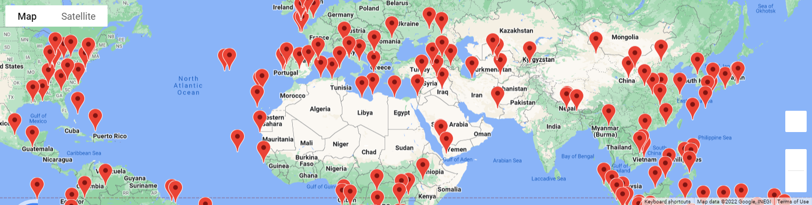
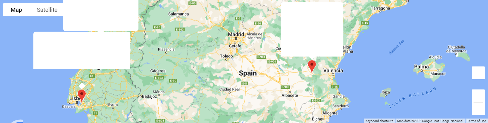
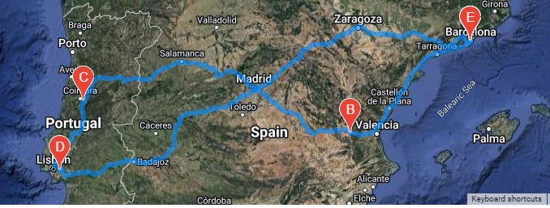

# World_Weather_Analysis
## Purpose of Module 6

* Using APIs for weather and google maps, we were able to construct a vacation search based on min/max temp for the expected location. the three maps below show where the travel will take place. 

